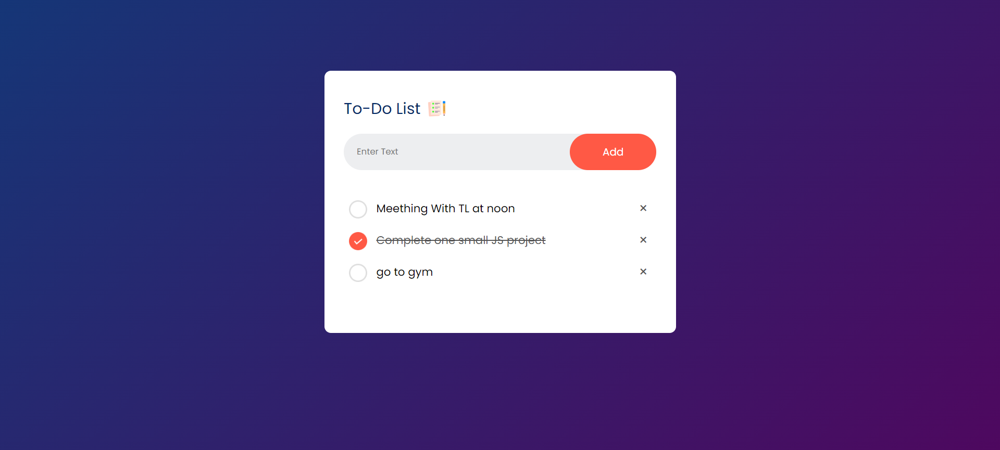

<h1>TODO App</h1>

<h2>Description</h2>

TODO App is a simple JavaScript project that allows users to create a to-do list, mark tasks as done, and delete tasks from the list. It's a great way to learn and practice JavaScript while managing your tasks efficiently.

<h2>Technologies Used</h2>
<ul>
    <li>HTML</li>
    <li>CSS</li>
    <li>JavaScript</li>
</ul>

<h2>Features</h2>
<ul>
    <li>Add tasks to the to-do list.</li>
    <li>Mark tasks as done.</li>
    <li>Delete tasks from the list.</li>
</ul>

<h2>Learnings</h2>

While developing this project, I gained experience in several key concepts and techniques including:

<ul>
    <li>Using local storage to persist data between sessions.</li>
    <li>Implementing event listeners to handle user interactions.</li>
    <li>Manipulating the DOM to dynamically update the user interface.</li>
    <li>Organizing JavaScript code into modular functions for better maintainability.</li>
</ul>

<h2>Screenshots</h2>

<h2>Author</h2>

This project is created by Vishal Pandey.
